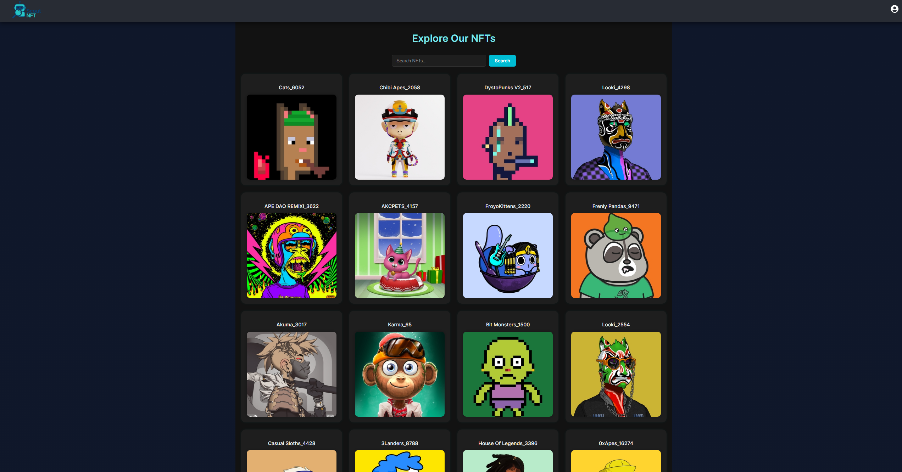

# ScoutNFT

NFT Recommendation System

## Overview

ScoutNFT is a platform that allows users to discover and collect NFTs. It provides a recommendation system that suggests NFTs based on user preferences and historical data.

## Features

- User authentication and authorization
- NFT search and discovery
- Personalized NFT recommendations
- NFT collection management

## Technologies Used

- Python
- FastAPI
- Supabase
- React

## UI Screen


## Installation

1. Clone the repository

```bash
git clone https://github.com/yourusername/ScoutNFT.git
```

2. Install the dependencies


```bash
python3 -m venv venv
source venv/bin/activate
pip3 install -r requirements.txt
```

3. Run the backend application

```bash
uvicorn main:app --reload
```

3. Run the frontend application

```bash
cd frontend
npm install
npm run dev
```

4. Install React Icons
```bash
npm install react-icons
```

5. Install b2sdk
```bash
pip install b2sdk
```

6. Install react router 
```bash
npm install react-router-dom
```
